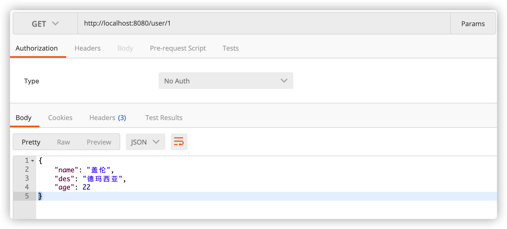
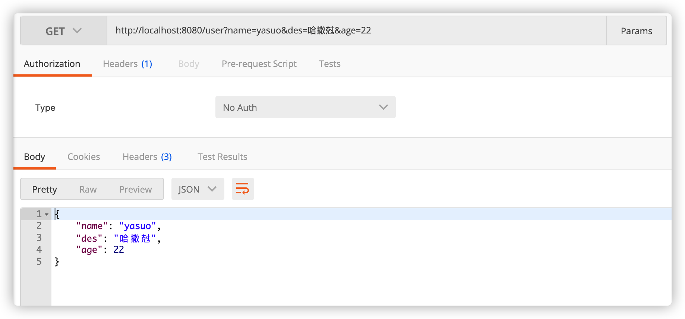
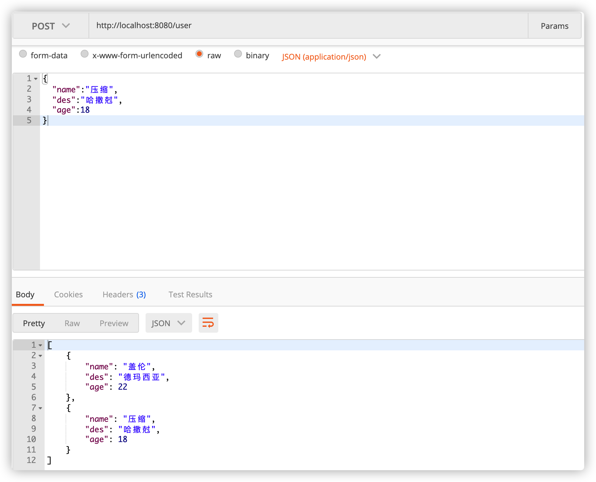
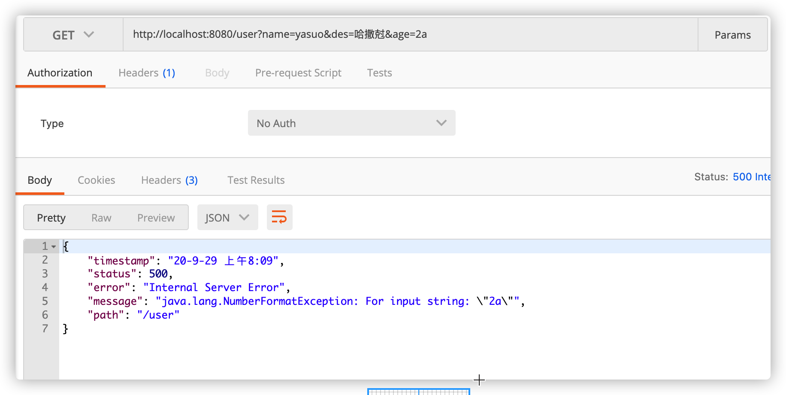
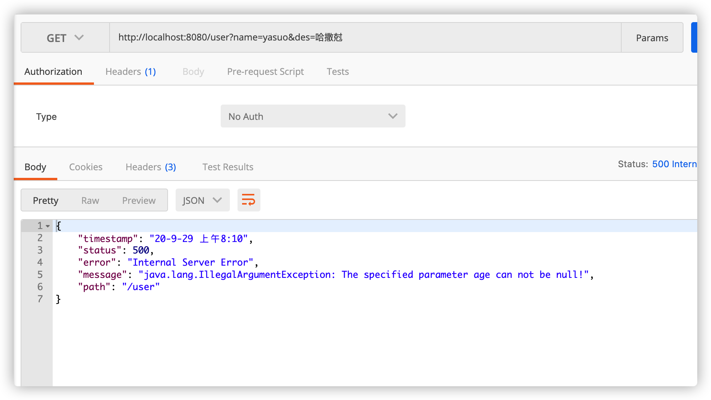

> 本项目已经同步到码云，地址：[https://gitee.com/SnailClimb/jsoncat](https://gitee.com/SnailClimb/jsoncat)。

原创开源不易，觉得不错的话，欢迎给良心作者 1 个 star 鼓励一下！

## 介绍

**jsoncat** 是我（Guide 哥，Gai 的哥）模仿 Spring Boot 写的一个轻量级的 HTTP 框架。

**jsoncat** 内置由 Netty 编写 HTTP 服务器，无需额外依赖 Tomcat 之类的 web 服务器。使用 Netty 几十行代码即可实现一个简易的 HTTP 服务，性能高且轻量。

**为什么要写？**

写这个东西只是自己个人的兴趣爱好使然，也不是说非要拿到项目上实际去使用，主要目的还是为了提高自己的编码能力。推荐小伙伴们也要尽量能够将自己的想法付诸于行动。

理论知识固然重要，但是脱离于实践的理论并不可靠。相比于 CRUD ，自己造个轮子，肯定是更有意思，也更能锻炼自己的编程能力和解决问题的能力。

## 特点

1. 内置由 Netty 编写 HTTP 服务器，无需额外依赖 Tomcat 之类的 web 服务
2. 代码简洁，可读性好
3. 支持 Spring MVC 常用的注解，用法也和 Spring MVC 基本一样
4. 后端只返回 json 数据给前端
5. 集成了 checkstyle 、spotbugs、pmd 并设置了 commit 钩子来保证代码质量

## 框架基本情况和代办

功能实现上，没有太去模仿参考 Spring 的源码，那样的话没太大必要，完全就是按照自己的想法写的，会借鉴一些 Spring 源码的思想。

功能其实写的挺快的，大部分时间都在重构。讲真， 我已经很尽力地保证代码的可读性了。尽量使用最少的代码实现功能， 并且不影响可读性。

目前，我还不是特别满意，欢迎小伙伴们一起来完善啊！人多力量大！

### 功能实现

#### Get 请求和 POST 请求处理

- [x] `@GetMapping` : 处理 Get 请求
- [x] `@PostMapping` ：处理 Post 请求
- [x] `@RequestBody` : 接收前端传递给后端的 json 字符串
- [x] `@RequestParam` ：获取 Get 请求的 URL 查询参数
- [x] `@PathVariable` : 获取 URL 中的参数/占位符

#### IOC

- [x] `@Autowired` ：注入对象
- [x] `@Component`：声明对象被 IOC 容器管理
- [x] `@Qualifier`: 指定注入的bean

#### AOP

- [ ] `@Aspect`
- [ ] `@Pointcut`
- [ ] `@Before`
- [ ] `@After`
- [ ] ......

#### 异常处理

- [ ] `@ControllerAdvice`
- [ ] `@ExceptionHandler`

#### 其他

- [ ] `@SpringBootApplication`
- [ ] `@Configuration`

### 代码质量

- [x] 集成 checkstyle
- [x] 集成 spotbugs （_遇到了一点小坑，将 gradle 版本升级为 6.6.1 解决_）
- [x] 设置 commit 钩子
- [x] 提高测试覆盖率，增加代码稳定性，为重构提供保障

## 功能演示

**`User.java` ：用户实体类**

```java
@Data
@AllArgsConstructor
public class User {
    private String name;
    private String des;
    private Integer age;
}
```

**`UserDto.java` ：用户业务处理类**

```java
@Component
public class UserService {
    private Integer id = 1;

    private final Map<Integer, User> users = new HashMap<Integer, User>() {
        {
            put(1, new User("盖伦", "德玛西亚", 22));
        }
    };

    public User get(Integer id) {
        return users.get(id);
    }

    public List<User> create(@RequestBody UserDto userDto) {
        users.put(++id, new User(userDto.getName(), userDto.getDes(), userDto.getAge()));
        return new ArrayList<>(users.values());

    }

    public void say() {
        System.out.println("UserService say 你真帅！");
    }
}

```

**`UserDto.java` : 创建用户的传输对象**

```java
@Data
@AllArgsConstructor
@NoArgsConstructor
public class UserDto {
    private String name;
    private String des;
    private Integer age;
}
```

**`UserController.java`：用户业务与前端交互类**

```java
@RestController("/user")
public class UserController {
    @Autowired
    private UserService userService;

    @GetMapping
    public User get(@RequestParam("name") String name, @RequestParam("des") String des, @RequestParam("age") Integer age) {
        return new User(name, des, age);
    }

    @GetMapping("/{id}")
    public User get(@PathVariable("id") Integer id) {
        return userService.get(id);
    }

    @PostMapping
    public List<User> create(@RequestBody UserDto userDto) {
        return userService.create(userDto);
    }
}
```

### Get 请求：`@PathVariable`传参

Get 请求：`@RequestParam`传参



### Post 请求



### 请求错误的处理情况

**当传入的参数类型不正确时：**



**当指定的参数未传递时：**

